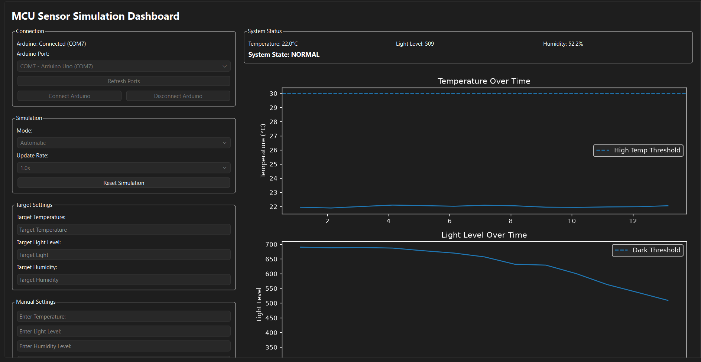
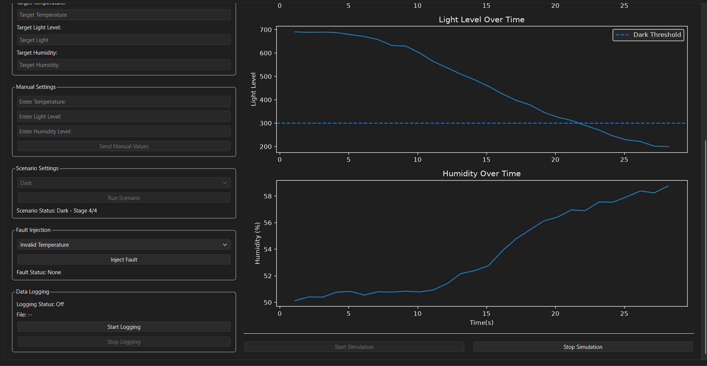

# MCU Sensor Simulation Dashboard
A desktop based sensor simulation and monitoring system that integrates a Python PyQt6 GUI with an arduino over serial communication.

The application simulates temperature, light, and humidity sensor data in real time allowing users to run predefined environmental scenarios, automatic simulations, manually control sensor data, inject sensor faults, visualize sensor data through graphs, and record simulation results to CSV files.

Serial communication is handled asynchronously using a worker thread, allowing the GUI to remain responsive during communication and connection failures.

## Features
1. Real-time temperature, light, and humidity sensor simulation
2. Automatic and manual simulation modes
3. Configurable sensor target values and simulation update rates
4. Predefined environmental scenarios
5. Sensor fault injection and fault recovery
6. Real-time sensor graphs using Matplotlib
7. CSV data logging with system state, scenario, and fault information
8. Using PyQt threads for asynchronous arduino serial communication
9. Automatic detection and handling of unexpected Arduino disconnections
10. Arduino-controlled system states and LED behavior

## Dashboard

The dashboard provides visual monitoring in the form of graphs, and status labels while communicating with the 
arduino over serial during any kind of simulation run.

## Scenario Simulation


Predefined scenarios progressively modify environmental conditions over multiple
stages. The example above shows the Dark scenario reducing the simulated light
level toward and below the configured dark threshold.

## Requirements

### Hardware
- Arduino Uno or compatible Arduino board
- USB cable for serial communication
- LED and resistor for system-state indication

### Software
- Python 3
- Arduino IDE
- PyQt6
- Matplotlib
- pyserial

## How to Run
1. Connect arduino to computer using USB
2. Open the firmware in the 'arduino/' folder using the Arduino IDE
3. Select the correct Arduino board and port, then upload the firmware
4. Open a terminal in the `pc/` folder.
5. Run the Python application:
   ```bash
   python gui.py
6. In the dashboard, click refresh ports
7. Select the Arduino's serial port and click Connect Arduino
8. Choose a simulation mode and begin using the dashboard.

## Usage

### Automatic Mode
Set target temperature, light, and humidity values and select an update rate. The simulator gradually adjusts the sensor values toward the selected targets while displaying the results in real time.

### Manual Mode
Enter temperature, light, and humidity values manually and send them directly to the Arduino.

### Scenarios
Run predefined environmental scenarios that change sensor conditions over multiple stages. Available scenarios include:
- Normal Operation
- Overheating
- Dark
- Overheat + Dark

### Fault Injection
Inject invalid or out-of-range sensor values to test the system's fault detection and recovery behavior. Faults remain latched until the system is reset.

### Data Logging
Record sensor readings to CSV files during a simulation. Logged data includes:
- Timestamp and elapsed time
- Temperature, light, and humidity
- System state
- Active scenario
- Fault information

### Real-Time Visualization
Temperature, light, and humidity are plotted in real time. Temperature and light graphs also display threshold indicators for high-temperature and dark conditions.

### Installation
Install the required packages using:
```bash
pip install -r requirements.txt
```

### Technologies used
- Python
- PyQt6
- Matplotlib
- pyserial
- Arduino / C++
- CSV
- Git and GitHub
